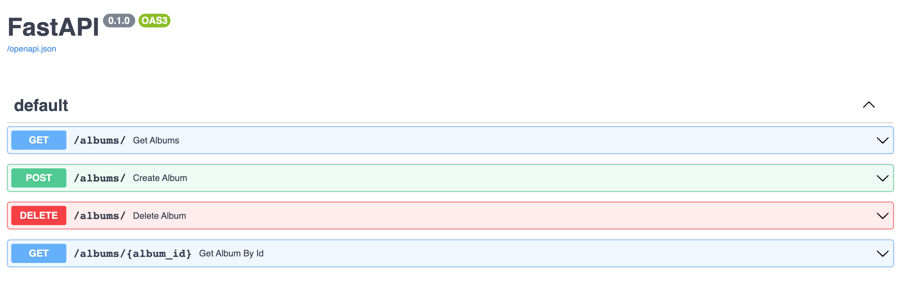

# A Sample CRUD API using [FastAPI](https://fastapi.tiangolo.com/)


## Running locally

```
./bootstrap.sh
```

This will create a directory a [virtualenv](https://virtualenv.pypa.io/en/latest/) `env` directory.

Use the `env` directory above:

```
source env/bin/activate
```

To start the application:

```
uvicorn app.main:app --reload
```
Go to swagger docs `http://127.0.0.1:8000/docs`


## Running in Docker

To run the application in docker, first build then run:

```
docker build -t <tag-name> .
docker run -d --name mycontainer -p 80:80 <tag-name>
http://127.0.0.1/redoc
```

## API Docs
